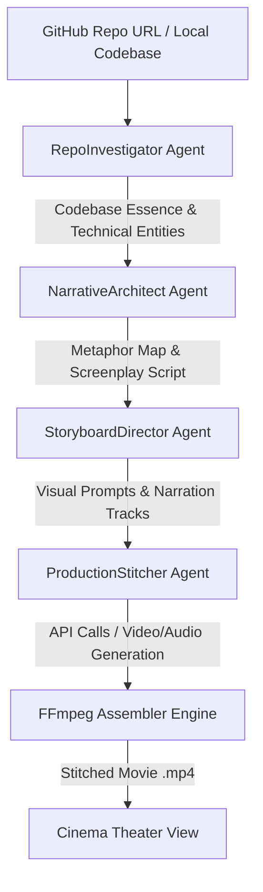

# Implementation Plan: Agentic Short Movie Generation Workflow (CineRepo)

This plan outlines the architecture, pipeline, and interactive web dashboard for **CineRepo**—an autonomous agentic workflow that translates software codebases and GitHub repositories into high-quality, 2-to-3 minute cinematic short movies that serve as poetic allegories for technical concepts.

---

## 1. System Architecture & Multi-Agent Pipeline

The core framework is structured as a multi-stage Python pipeline that coordinates individual specialist agents.

### Specialist Agent Profiles

1. **RepoInvestigator (The Code Archaeologist)**
   - **Input**: GitHub URL or local folder path.
   - **Action**: Analyzes files, README, dependencies, and code structure. Identifies crucial technical mechanisms (e.g., SQLite FTS5 persistence, RPC parallel sub-agents).
   - **Output**: A structured JSON detailing the codebase's value proposition, functional flow, and core architecture components.

2. **NarrativeArchitect (The Metaphor Screenwriter)**
   - **Input**: Technical essence JSON from `RepoInvestigator`.
   - **Action**: Generates a rich, cinematic allegory. Maps technical components to narrative entities (e.g., SQLite database becomes "Roots of Light", RPC parallel agents become "Splitting Crystalline Core"). Writes a timed, 4-scene screenplay with narration script and character profiles.
   - **Output**: Screenplay Markdown and a Metaphor Map.

3. **StoryboardDirector (The Cinematic Prompt Crafter)**
   - **Input**: Screenplay from `NarrativeArchitect`.
   - **Action**: Designs specific visual styling guidelines (Cyber-Organic, Solarpunk-meets-Cyberpunk, moody bioluminescent lighting). Creates highly descriptive prompts for image/video generators and formats narration audio prompt configs.
   - **Output**: Storyboard JSON containing detailed visual prompts, scene timings, and voiceover text.

4. **ProductionStitcher & FFmpeg Engine (The Master Editor)**
   - **Input**: Storyboard JSON and asset directories.
   - **Action**: Orchestrates external API calls (e.g., Fal.ai, Imagen 3, ElevenLabs) or local dry-runs to generate individual media clips (image keys, video segments, narrative voiceovers, and background soundtracks). Runs `ffmpeg` commands to overlay audio, adjust volumes, and compile segments into a final synchronized `.mp4` movie.
   - **Output**: Rendered master `.mp4` movie.

---

## 2. Interactive Glassmorphic Web Dashboard

To make this pipeline incredibly interactive, we will build a beautiful React + Vite frontend dashboard featuring:
1. **Interactive Node Orchestrator**: Displays the live execution status of the multi-agent pipeline with glowing progress micro-animations.
2. **Concept & Metaphor Visualizer**: Renders an interactive map of how technical features map to story metaphors (e.g. SQLite database -> Roots of Light).
3. **Storyboard Grid**: An elegant gallery showing the screenplay script, scenes, visual prompt text, narration audio control, and generated scene images.
4. **Cinematic Theater**: A premium, dark-mode theatre section with a styled custom video player to watch the compiled movie.

---

## 3. Tech Stack & Integration Directory

- **Backend**: Python 3.14.3, leveraging Google GenAI SDK (Gemini 2.5/1.5 Pro) for narrative reasoning, scriptwriting, and image prompting.
- **Video Processing**: FFmpeg (programmatic subprocess bindings in Python).
- **Frontend**: React, Vite, Vanilla CSS (rich glassmorphism, glowing micro-animations, dark-mode, custom sliders).
- **Assets**: Using high-quality URLs from our successful Flowith run to ensure a fully functional, instantly beautiful workspace dry-run.

---

## 4. Implementation Steps

### Phase 1: Python Pipeline Core
- **`agents/repo_investigator.py`**: Git parsing and codebase analysis.
- **`agents/narrative_architect.py`**: Allegorical script writer.
- **`agents/storyboard_director.py`**: Cinematic prompting and visual structuring.
- **`stitcher/ffmpeg_assembler.py`**: Programmatic audio overlays, crossfades, and clip combining.

### Phase 2: Web Frontend Dashboard
- Create the Vite + React workspace in `./movie_generation_dashboard/`.
- Build the glassmorphic CSS theme (`index.css`) with glowing nodes and interactive states.
- Connect the frontend controls to the Python orchestration server.

### Phase 3: Verification & Polish
- Ensure standard execution without external key requirements (by providing high-quality cached Flowith resources as a reliable default fallback).
- Verify the video generation and audio stitching flow.
