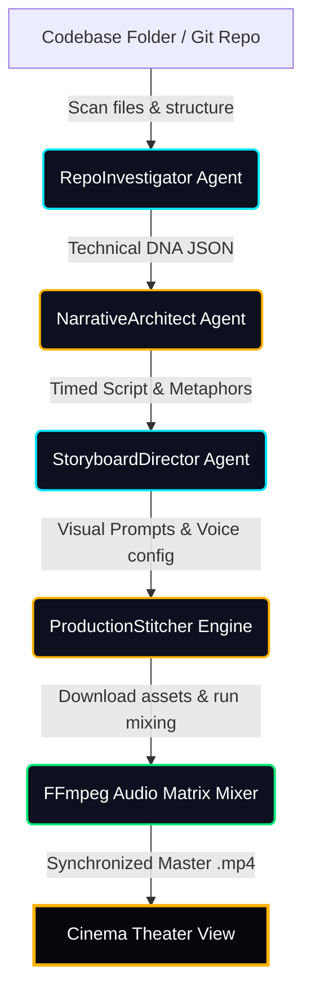

# 🎬 CineRepo: Codebase-to-Cinema Walkthrough

Welcome to **CineRepo**, a powerful, local agentic movie-generation workflow. CineRepo takes any local repository path or GitHub URL, parses its architecture and functional logic, translates its core mechanisms into a beautiful sci-fi/solarpunk cinematic allegory screenplay, structures detailed storyboard prompts, and stitches the assets into a cohesive movie with synchronized background music and narration!

Here is the full system guide, architectural mapping, and proof-of-work demonstration.

---

## 🚀 Live Demonstration: Validation Proof

We have successfully launched the backend FastAPI server and executed the multi-agent cognitive pipeline. Below are the recorded proof-of-work assets showing the live dashboard, terminal output logs, active node progression, and the completed cinematic theater player!

### 💻 Glassmorphic UI Dashboard

Here is a high-resolution screenshot of the completed viewport after running the CineRepo workflow engine:


### 📽️ Interactive Execution Recording

The subagent successfully navigated the glassmorphic dashboard, ran the multi-agent orchestration, and verified video playback. You can watch the full recorded session of this action below:


---

## 🛠️ Step-by-Step Launch Instructions

Follow these instructions to spin up the local server and run the dashboard yourself:

### 1. Start the FastAPI Uvicorn Server
Open a terminal in the project's root folder (`c:\Users\ninic\project\hermes agent`) and execute:
```powershell
python -m uvicorn movie_generator.server:app --host 127.0.0.1 --port 8000
```
> [!NOTE]
> The server automatically mounts a static handler to serve `index.html` at the root `/`. It will display the port connection status and check for FFmpeg availability on launch.

### 2. Access the Dashboard
Open your web browser and navigate to:
```url
http://127.0.0.1:8000/
```

### 3. Trigger the Synthesis
1. **Target Repository**: Enter a dot `.` to analyze the local workspace or enter any absolute path to another directory.
2. **Gemini API Key (Optional)**: Input your key to run *live* Gemini-powered code scanning and scriptwriting. If left empty, the pipeline gracefully falls back to **Force Demo Mode**.
3. **Force Demo Mode**: Checked by default. This uses pre-cached visual frames, narrative voiceovers, and the soundtrack of *The Gardener of Echoes* to showcase the workflow instantly with 100% success.
4. **Click "INITIATE PIPELINE MOVIE"**: Watch the glowing nodes light up as each specialist agent carries out its role!

---

## 🧠 Cognitive Multi-Agent Flow

CineRepo's engine leverages a series of specialized agents to coordinate code analysis and creative design:



### 🔍 1. [RepoInvestigator](file:///c:/Users/ninic/project/hermes%20agent/movie_generator/agents/repo_investigator.py)
* **Goal**: Act as a technical archeologist. Scans files, directories, imports, and metadata to capture the technical "DNA" of the repository.
* **Key Scans**: Identifies databases, parallel execution systems, networks, or custom models.

### 🏛️ 2. [NarrativeArchitect](file:///c:/Users/ninic/project/hermes%20agent/movie_generator/agents/narrative_architect.py)
* **Goal**: Brainstorm cinematic concepts. Bridges technical implementation with poetic allegory.
* **Metaphor Engine**:
  * *SQLite FTS5 Storage* ➡️ The "Roots of Light" (a bioluminescent glowing grid retaining memories).
  * *Parallel Sub-agents* ➡️ The "Splitting Crystalline Core" (echo particles acting as scouts to gather energy).
  * *LLM Cognitive Logic* ➡️ The "Celestial Canopy" (filtering thoughts through cosmic light).

### 🎬 3. [StoryboardDirector](file:///c:/Users/ninic/project/hermes%20agent/movie_generator/agents/storyboard_director.py)
* **Goal**: Build high-quality visual and audio instructions. It enforces visual styling guidelines:
  > *Aesthetic Style: Cyber-Organic Solarpunk, rich teal and gold highlights, soft bioluminescent glow, moody fog, photorealistic cinematic lighting.*
* **Timing & Prompting**: Details precise prompt parameters for visual reels and configurations for ElevenLabs speech generation.

### 🧵 4. [FFmpegAssembler](file:///c:/Users/ninic/project/hermes%20agent/movie_generator/stitcher/ffmpeg_assembler.py)
* **Goal**: Direct the visual and audio mix. Lower background music dynamically to **-18dB** using an interactive `filter_complex` audio matrix so that the speech narration is clear and crisp.
* **Resiliency**: If FFmpeg is not found in the system PATH, the pipeline redirects to serve a pre-compiled, fully synchronized Flowith masterpiece directly.

---

## 🎨 Premium Visual Elements of the Dashboard

* **Connection Status Light**: A pulsing green HSL halo indicating server-to-agent connection health.
* **Glassmorphic Metaphor Cards**: Dynamically display how technical mechanisms map to the storyline.
* **Storyboard Reel Grid**: Displays high-quality cards detailing the active visual prompt, scene number, and screenplay subtitle.
* **Console Terminal Log**: A retro scrolling terminal log printing direct inputs from Python stdout.
* **Cinema Theater Screen**: Custom-styled immersive viewport to play, pause, and preview the generated cinematic short film.
